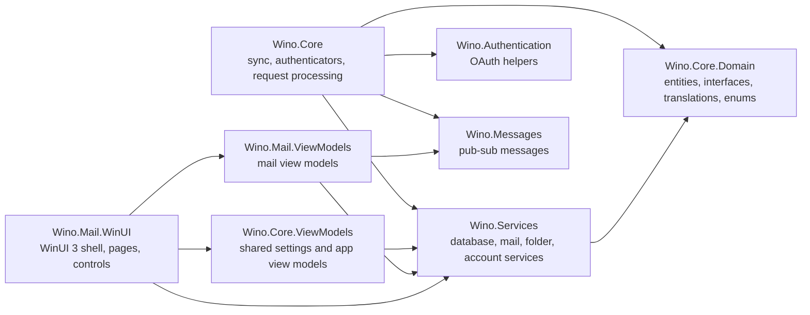
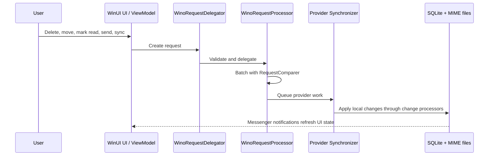

# Contribution Guideline

This project started as a side project of mine but grew something bigger than I expected and people loved it. Therefore, I open sourced it for others to contribute as well to have the best alternative mail client to Mail & Calendars so far.

You can contribute to Wino in multiple ways. It can be a feedback or bug report you open here, join discussions in the Discord channel to shape the way the product goes, create proposals or check for opened and approved bugs to fix them.

Feeling rich? You can always [donate via Paypal](https://www.paypal.com/donate/?hosted_button_id=LGPERGGXFMQ7U)


## Getting Started

Wino Mail is a native Windows mail client built with [WinUI 3](https://learn.microsoft.com/en-us/windows/apps/winui/winui3/) and the [Windows App SDK](https://learn.microsoft.com/en-us/windows/apps/windows-app-sdk/). The active desktop application is **Wino.Mail.WinUI**.

**Minimum Windows version:** Windows 10 1809 (10.0.17763.0)

**Target Windows SDK:** Windows 10 2004 (10.0.19041.0)

## Prerequisites

* ".NET desktop development" workload in Visual Studio 2022+
* .NET SDK 10.0+
* Windows App SDK dependencies installed through NuGet restore

After cloning the repo, open **WinoMail.slnx** in Visual Studio 2022+ and set **Wino.Mail.WinUI** as the startup project.

For command-line builds, restore with the repo NuGet config and build the WinUI app for your target platform:

```bash
dotnet restore Wino.Mail.WinUI/Wino.Mail.WinUI.csproj --configfile nuget.config -p:Platform=x64 -p:RuntimeIdentifier=win-x64
dotnet build Wino.Mail.WinUI/Wino.Mail.WinUI.csproj -c Debug --no-restore /p:Platform=x64 /p:RuntimeIdentifier=win-x64 /p:GenerateAppxPackageOnBuild=false /p:AppxPackageSigningEnabled=false
```

Supported build platforms are **x86**, **x64**, and **ARM64**.

## Project Architecture

Wino Mail supports 3 different types of synchronization depending on the provider type.

- Outlook / Office 365
- Gmail
- IMAP / SMTP

The project uses [MimeKit](https://github.com/jstedfast/MimeKit) and [MailKit](https://github.com/jstedfast/MailKit/) extensively for MIME parsing and IMAP/SMTP synchronization. Outlook/Office 365 synchronization is built on [Microsoft Graph SDK](https://github.com/microsoftgraph/msgraph-sdk-dotnet), and Gmail synchronization is built on the [Gmail API Client Library](https://developers.google.com/api-client-library/dotnet/apis/gmail/v1).

Authentication is handled by **Authenticators**, except for IMAP. Server info and credential details are stored in the **CustomServerInformation** table in the database. For API synchronizers, check out **GmailAuthenticator** and **OutlookAuthenticator**.

Each action you take on mails (like mark as read, delete, move etc.) is delegated as a request to **WinoRequestDelegator** and **WinoRequestProcessor** respectively. These services do preliminary checks, batch requests to reduce network calls to APIs or IMAP servers, queue them to the corresponding synchronizer for the account, and optionally ask the synchronizer to run them in batches. Requests are batched by the logic in **RequestComparer**.





### Solution Overview

**Wino.Mail.WinUI**: Active WinUI 3 desktop application. This project contains the shell, pages, controls, styles, assets, activation handling, WebView2 mail rendering, packaging manifest, and Windows-specific services. Launch this project to debug Wino Mail.

**Wino.Mail.ViewModels**: Mail-specific view models for the WinUI app. Keep UI state and interaction logic here, and delegate account, sync, settings, and persistence work to services.

**Wino.Core.ViewModels**: Shared view models used by app-level experiences such as settings, personalization, and cross-feature UI state.

**Wino.Core**: Core synchronization engine, authenticators, request processing, provider integrations, and change processors. This is where Outlook, Gmail, and IMAP sync behavior lives.

**Wino.Services**: Shared services for database access, mail, folders, accounts, MIME file storage, preferences, logging, and other app infrastructure.

**Wino.Core.Domain**: Shared contracts, entities, interfaces, translations, enums, and domain models.

**Wino.Authentication**: OAuth2 authentication helpers for Microsoft and Google account flows.

**Wino.Messages**: Pub-sub message definitions used with CommunityToolkit.Mvvm Messenger.

**Wino.Calendar.ViewModels**: Calendar-related view models shared by the WinUI shell.

**Wino.SourceGenerators**: Source generators used by the domain and UI projects, including generated translation helpers.

**Wino.Core.Tests**, **Wino.Mail.ViewModels.Tests**, **Wino.Mail.Test.WinUI**: Automated test projects for core services, view models, and WinUI-specific behavior.

### Good to know

- App data paths are initialized in **Wino.Mail.WinUI\WinoApplication.cs** and exposed through **ApplicationConfiguration**. The SQLite database file is **Wino200.db** under the publisher shared **WinoShared** folder. Local app storage is used for logs, MIME files, contact pictures, thumbnails, custom themes, calendar attachments, and temporary app data.
- Mail and calendar now live inside the same WinUI application experience. Calendar is an app entry/mode backed by the same database and service layer, not a separate Wino Calendar application.
- The database stores mail and calendar metadata, not full MIME content. Mail body MIME files are saved on demand under the local **Mime** folder, with **MailCopy.FileId** resolving to files through **MimeFileService**. Calendar ICS cache files live under the MIME storage root in **CalendarIcs**.
- Project tries to follow MVVM pattern as much as possible. [MVVM Toolkit](https://learn.microsoft.com/en-us/dotnet/communitytoolkit/mvvm/) is used for observable properties, commands, and messaging. Prefer generated public partial properties and commands over manual boilerplate.
- Project has event Pub-Sub on top of MVVM and it's widely used with [Messenger](https://learn.microsoft.com/en-us/dotnet/communitytoolkit/mvvm/messenger). Messenger handlers may run off the UI thread, so dispatch before updating UI-bound state or touching WinUI/WinRT APIs.
- As a rule, I want to avoid introducing new libraries into the code as much as I can. Try to avoid it as long as you really really don't need it. This will help maintainability going forward.
- Project has custom localization system built in to support changing the language at runtime. Add or change source strings only in **Wino.Core.Domain\Translations\en_US\resources.json**. **Translator** properties are generated during build by the source generator. Non-English resources are maintained with **scripts\translate_resources.py** and audited with **scripts\validate_resources.py**; do not hand-edit localized **resources.json** files.
- Cached user settings and exported/imported preferences are managed in **PreferencesService**.
- Cached UI values at runtime, like whether the reader is opened or whether the navigation menu is opened, are managed in **StatePersistenceService**.
- Rendering mails is done with [WebView2](https://learn.microsoft.com/en-us/microsoft-edge/webview2/). **Wino.Mail.WinUI** has a **JS** folder for that purpose. **reader.html** is for reading mails, and **editor.html** is for composing mails. The WinUI app maps these files through WebView2 virtual hosts such as **https://wino.mail/reader.html** and **https://app.editor/editor.html**.
- Dependency injection is configured from **Wino.Mail.WinUI\App.xaml.cs**. Core services are registered through **RegisterCoreServices()** in **Wino.Core\CoreContainerSetup.cs**, shared services through **RegisterSharedServices()** in **Wino.Services\ServicesContainerSetup.cs**, and view models through the WinUI app registration.
- x86, x64 and ARM64 are supported.

## How to work on
### New Issues

**Please create an issue here first and say that you would like to work on it**. I'll have it assigned to you after confirming the bug.

### Existing Issues

**Please comment under the issue** and I'll have it assigned to you. This will prevent all of us to save big time.

### New Implementations and Big Things

If you'd like to work on something big and implement a huge new system into the code, **please create a proposal first**. We can collectively discuss over the proposal, gather more feedback to improve it or just accept it as it is. 

**Please keep in mind that not all of the proposals will go to Wino.** Project's first goal is to create the same experience as Windows Mail & Calendars. At some point if your proposal will go against the motto your proposal might be rejected for implementation. Keep in mind that we are not trying to become the next Outlook or other major fully featured mail clients here (yet). Therefore, it's important to start working on it as soon as the proposal is approved, not before. I appreciate your understanding on this matter.

## Additional Help

Project does not have a separate Discord server, but has 2 different dedicated channels under 2 different servers that I actively monitor every day.

**[UWP Community](https://discord.gg/wNMGxYZMFy)** under Apps & Projects -> **wino-mail**

**[Developer Sanctuary](https://discord.gg/windows-apps-hub-714581497222398064)** under Community Projects -> **wino-mail**

You can always send an e-mail to bkaankose (at) outlook.com for extras.


