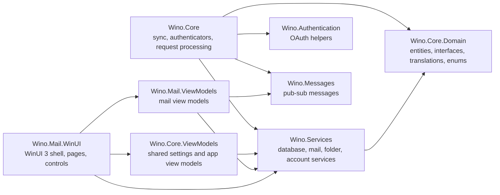
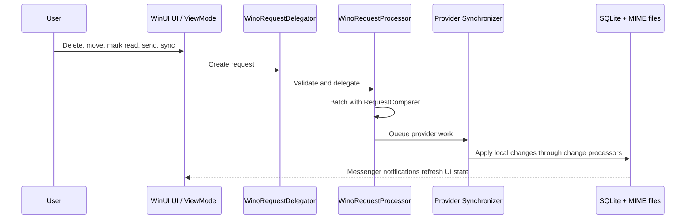

# Contributing to Wino Mail

Wino Mail started as a personal project and grew through community interest. Contributions can include code, tests, documentation, bug reports, and proposals.

Read this guide before you start implementation. For coding-agent rules, also read [`AGENTS.md`](AGENTS.md) and any closer `AGENTS.md` file.

## Contribution policy

Create an issue before you work on a new bug or feature. If an issue already exists, comment there before you start implementation.

Create a proposal before you design a large feature or a new subsystem. Wait for maintainer approval before you start that work.

Wino preserves the direct experience of Windows Mail and Calendar. A proposal can be rejected when it conflicts with this product direction.

AI-assisted contributions are welcome. Contributors remain responsible for the design, code, tests, security, and accuracy of every submitted change.

AI-assisted changes must obey the same architecture, coding rules, and maintainer decisions as manually written changes.

## Development requirements

Wino development requires Windows because the active application is a packaged WinUI 3 desktop application.

- Windows 10 version 1809 or later, or Windows 11
- Visual Studio 2022 or later with the **.NET desktop development** workload
- The .NET SDK from [`global.json`](global.json), currently .NET SDK 10.0.301
- Git and PowerShell
- Windows Developer Mode for local package deployment and UI tests
- WinApp CLI 0.6 or later for application launch and UI tests

NuGet restore installs the Windows App SDK and other managed dependencies. Wino supports x86, x64, and ARM64 package builds.

## First build

1. Clone the repository.
2. Open [`WinoMail.slnx`](WinoMail.slnx) in Visual Studio 2022 or later.
3. Select **Debug** and **x64**.
4. Set [`Wino.Mail.WinUI`](src/Wino.Mail.WinUI/Wino.Mail.WinUI.csproj) as the startup project.
5. Restore the packages.
6. Build the application with the repository harness.

```powershell
dotnet restore src/Wino.Mail.WinUI/Wino.Mail.WinUI.csproj --configfile nuget.config -p:Platform=x64 -p:RuntimeIdentifier=win-x64
.\scripts\wino.ps1 build app
```

Restore after a fresh clone. Restore again after package, target-framework, or runtime-identifier changes.

Do not work in the deprecated UWP application. The active desktop application is [`src/Wino.Mail.WinUI`](src/Wino.Mail.WinUI/Wino.Mail.WinUI.csproj).

## Development harness

Use [`scripts/wino.ps1`](scripts/wino.ps1) as the shared entry point for local development and coding agents.

| Task | Command |
| --- | --- |
| Show affected projects and tests | `.\scripts\wino.ps1 affected` |
| Build the WinUI application | `.\scripts\wino.ps1 build app` |
| Run core tests | `.\scripts\wino.ps1 test core` |
| Run a narrow test group | `.\scripts\wino.ps1 test core -Filter "FullyQualifiedName~RelevantTestClass"` |
| Launch the Debug application | `.\scripts\wino.ps1 run app` |
| Launch with diagnostic output | `.\scripts\wino.ps1 debug app` |
| Run application UI scenarios | `.\scripts\wino.ps1 ui app` |
| Format changed XAML | `.\scripts\wino.ps1 xaml changed` |
| Check changed XAML formatting | `.\scripts\wino.ps1 xaml changed -Check` |
| Show all harness commands | `.\scripts\wino.ps1 help` |

Run the narrowest build and tests that prove your change. Follow the verification matrix in [`AGENTS.md`](AGENTS.md) for UI, synchronization, localization, and release work.

## Project architecture

Wino contains four application modes: Mail, Calendar, People, and To Do. These modes share one WinUI executable, database, service layer, and account model.

Mail synchronization supports Microsoft Graph, Gmail API, IMAP/SMTP, and POP3/SMTP. Calendar, contacts, and tasks can use provider, DAV, or local backends.

The project uses [MimeKit](https://github.com/jstedfast/MimeKit) and [MailKit](https://github.com/jstedfast/MailKit/) for MIME and standard mail protocols. Microsoft Graph supplies Microsoft integrations. Google APIs supply Google integrations.

Provider authenticators live in [`Wino.Authentication`](src/Wino.Authentication). IMAP and POP3 credentials use [`CustomServerInformation`](src/Wino.Core.Domain/Entities/Shared/CustomServerInformation.cs).

Mail actions pass through [`WinoRequestDelegator`](src/Wino.Core/Services/WinoRequestDelegator.cs) and [`WinoRequestProcessor`](src/Wino.Core/Services/WinoRequestProcessor.cs). These services prepare, batch, and send requests to the correct synchronizer.


```mermaid
flowchart LR
    UI["Wino.Mail.WinUI<br/>WinUI 3 shell, pages, controls"]
    MailVM["Wino.Mail.ViewModels<br/>mail view models"]
    CoreVM["Wino.Core.ViewModels<br/>shared settings and app view models"]
    Services["Wino.Services<br/>database, mail, folder, account services"]
    Core["Wino.Core<br/>sync, authenticators, request processing"]
    Domain["Wino.Core.Domain<br/>entities, interfaces, translations, enums"]
    Auth["Wino.Authentication<br/>OAuth helpers"]
    Messages["Wino.Messages<br/>pub-sub messages"]

    UI --> MailVM
    UI --> CoreVM
    UI --> Services
    MailVM --> Services
    CoreVM --> Services
    Services --> Domain
    Core --> Services
    Core --> Auth
    Core --> Domain
    MailVM --> Messages
    Core --> Messages
```


```mermaid
sequenceDiagram
    participant User
    participant UI as WinUI UI / ViewModel
    participant Delegator as WinoRequestDelegator
    participant Processor as WinoRequestProcessor
    participant Sync as Provider Synchronizer
    participant DB as SQLite + MIME files

    User->>UI: Delete, move, mark read, send, sync
    UI->>Delegator: Create request
    Delegator->>Processor: Validate and delegate
    Processor->>Processor: Batch with RequestComparer
    Processor->>Sync: Queue provider work
    Sync->>DB: Apply local changes through change processors
    DB-->>UI: Messenger notifications refresh UI state
```

## Project guide

- [`Wino.Mail.WinUI`](src/Wino.Mail.WinUI) contains the shell, pages, styles, activation routes, package manifest, and Windows services.
- [`Wino.Mail.ViewModels`](src/Wino.Mail.ViewModels) contains mail and application-mode view models.
- [`Wino.Calendar.ViewModels`](src/Wino.Calendar.ViewModels) contains calendar view models and calendar state.
- [`Wino.Core.ViewModels`](src/Wino.Core.ViewModels) contains shared settings and application view models.
- [`Wino.Core`](src/Wino.Core) contains synchronization, provider integrations, request processing, and change processors.
- [`Wino.Services`](src/Wino.Services) contains database, account, mail, folder, task, contact, preference, and file services.
- [`Wino.Core.Domain`](src/Wino.Core.Domain) contains shared contracts, entities, interfaces, translations, enums, and models.
- [`Wino.Authentication`](src/Wino.Authentication) contains Microsoft and Google OAuth helpers.
- [`Wino.Messages`](src/Wino.Messages) contains CommunityToolkit messenger contracts.
- [`Wino.SourceGenerators`](src/Wino.SourceGenerators) generates translation and other compile-time code.
- [`controls`](controls) contains highly customized controls shared by Wino applications. It is not a general-purpose control library.
- [`Wino.Editor`](controls/Wino.Editor) contains the HTML, CSS, and JavaScript assets for mail reading and composition.
- [`Wino.Mail.Controls.Playground`](controls/Wino.Mail.Controls.Playground) is the quick test application for controls before full application integration.
- [`tests`](tests) contains unit, smoke, Native AOT, notification-host, and UI tests.

## Notification architecture

The package manifest defines four visible application entries: Wino Mail, Wino Calendar, Wino People, and Wino To Do. They share the main WinUI executable.

Windows identifies packaged applications with an Application User Model ID (AUMID). Each application mode needs a separate notification identity and activation route.

The [`Package.appxmanifest`](src/Wino.Mail.WinUI/Package.appxmanifest) therefore defines four hidden notification-host applications. These entries create one notification AUMID for each mode.

Each AUMID starts a small, single-purpose executable:

- [`Wino.Mail.NotificationHost`](src/Wino.Mail.NotificationHost)
- [`Wino.Calendar.NotificationHost`](src/Wino.Calendar.NotificationHost)
- [`Wino.People.NotificationHost`](src/Wino.People.NotificationHost)
- [`Wino.Tasks.NotificationHost`](src/Wino.Tasks.NotificationHost)

The four executables share [`Wino.NotificationHost`](src/Wino.NotificationHost), which contains the notification runtime. This design isolates each `AppNotificationManager` registration from the shared UI executable.

[`NotificationHostClient`](src/Wino.Mail.WinUI/Services/NotificationHostClient.cs) writes a request envelope and activates the required AUMID. The host processes that request under the correct notification identity.

Notification clicks enter the matching COM activator. The host writes an activation envelope and forwards it to the main application.

[`ForwardedNotificationActivationStore`](src/Wino.Mail.WinUI/Activation/ForwardedNotificationActivationStore.cs) reads the forwarded activation. [`AppNotificationHandler`](src/Wino.Mail.WinUI/Activation/AppNotificationHandler.cs) routes it to the correct application mode.

Shared request formats and AUMID mappings live in [`Wino.NotificationHost.Contracts`](src/Wino.NotificationHost.Contracts). Notification-host tests live in [`Wino.NotificationHost.Tests`](tests/Wino.NotificationHost.Tests).

Do not register all four notification identities in the main executable. Keep each registration and COM activation path attached to its dedicated host executable.

## Data and application state

[`WinoApplication`](src/Wino.Mail.WinUI/WinoApplication.cs) initializes application data paths. The SQLite database is `Wino200.db` in the publisher-shared `WinoShared` folder.

The database stores mail and calendar metadata. [`MimeFileService`](src/Wino.Services/MimeFileService.cs) resolves downloaded MIME files from application-local storage.

[`PreferencesService`](src/Wino.Mail.WinUI/Services/PreferencesService.cs) stores user settings and imported or exported preferences. [`StatePersistenceService`](src/Wino.Mail.WinUI/Services/StatePersistenceService.cs) stores temporary UI state.

Mail rendering and composition use [WebView2](https://learn.microsoft.com/en-us/microsoft-edge/webview2/) through [`Wino.Editor`](controls/Wino.Editor). Do not add a second editor asset bundle to the WinUI project.

## View models and messaging

Wino uses [CommunityToolkit.Mvvm](https://learn.microsoft.com/en-us/dotnet/communitytoolkit/mvvm/) for observable properties, commands, and messaging.

Use public partial properties with `[ObservableProperty]`. Do not annotate private backing fields.

Register messenger recipients in `RegisterRecipients()`. Unregister them in `UnregisterRecipients()`.

Messenger handlers can run outside the UI thread. Dispatch UI-bound state and WinRT work through `ExecuteUIThread(...)` or the correct dispatcher.

Dependency injection starts in [`App.xaml.cs`](src/Wino.Mail.WinUI/App.xaml.cs). Core and shared registrations live in [`CoreContainerSetup`](src/Wino.Core/CoreContainerSetup.cs) and [`ServicesContainerSetup`](src/Wino.Services/ServicesContainerSetup.cs).

Avoid new packages when the platform or repository already supplies the required function.

## Localization

Developers must add or update source strings only in [`en_US/resources.json`](src/Wino.Core.Domain/Translations/en_US/resources.json).

Use the generated `Translator` properties in C# and XAML. Do not edit non-English resource files.

Before a release, the project AI translation script updates other languages from the English source file. Contributors do not run or modify that release translation output for ordinary changes.

## Controls and XAML

The `controls` projects contain highly customized controls for Wino. They are shared across Wino applications but are not general-purpose reusable libraries.

Use [`Wino.Mail.Controls.Playground`](controls/Wino.Mail.Controls.Playground) for quick control tests before integration into the full application.

Read [`controls/AGENTS.md`](controls/AGENTS.md) before you change a shared control. Format changed XAML with the repository harness before handoff.

## Before you submit

1. Review the diff and remove unrelated changes.
2. Run the narrowest relevant build and tests.
3. Run the XAML and UI checks when the change affects the interface.
4. Add or update tests for changed behavior.
5. Describe what you verified and what remains unverified.

## Additional help

The project has dedicated community channels:

- [UWP Community](https://discord.gg/wNMGxYZMFy), under **Apps & Projects → wino-mail**
- [Developer Sanctuary](https://discord.gg/windows-apps-hub-714581497222398064), under **Community Projects → wino-mail**

You can also contact `bkaankose (at) outlook.com`.

## Donate

You can [donate with PayPal](https://www.paypal.com/donate/?hosted_button_id=LGPERGGXFMQ7U).
